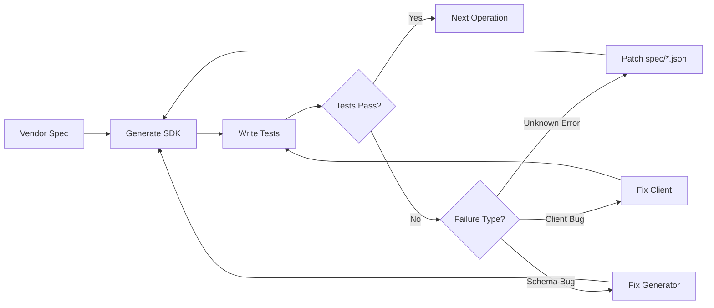

# Distilled

Effect-native SDKs with exhaustive error typing. We use a TDD-driven approach to discover, document, and patch missing API behavior from vendor specifications.

## The Problem

Cloud provider APIs have incomplete or incorrect specifications:
- Missing error types (APIs return errors not in the spec)
- Incorrect schemas (nullable fields marked required, wrong types)
- Undocumented behavior (rate limits, eventual consistency)

This leads to runtime surprises and `catch (e: unknown)` everywhere.

## The Solution

Each sub-project generates an Effect-native SDK from a vendor specification, then uses TDD to discover and patch missing errors. The result is a fully typed SDK where every error is in the type signature.



## Monorepo Structure

```
distilled/
├── AGENTS.md                 # This file - ecosystem overview
├── distilled-aws/            # AWS SDK from Smithy models
├── distilled-cloudflare/     # Cloudflare SDK from TypeScript SDK
├── distilled-code/           # Programmatic coding agent library
└── distilled.cloud/          # Marketing & docs site (Astro)
```

Each sub-project has its own `AGENTS.md` with specialized context. This document covers shared patterns.

## The Universal TDD Loop

All distilled SDKs follow this process:

### 1. Generate SDK from Spec

```bash
bun generate                    # Generate all services
bun generate --sdk s3           # AWS: single service
bun generate --service r2       # Cloudflare: single service
```

The generator produces:
- Effect Schema types with HTTP trait annotations
- Operations returning `Effect<Output, TypedErrors, Requirements>`
- Error classes with matching traits (status codes, error codes, messages)

### 2. Write Tests for Each Operation

Tests cover both happy and unhappy paths:

```typescript
describe("getBucket", () => {
  test("happy path - returns bucket metadata", () =>
    Effect.gen(function* () {
      const bucket = yield* getBucket({ name: "my-bucket" });
      expect(bucket.name).toBe("my-bucket");
    }));

  test("error - NoSuchBucket for non-existent", () =>
    getBucket({ name: "does-not-exist" }).pipe(
      Effect.flip,
      Effect.map((e) => expect(e._tag).toBe("NoSuchBucket")),
    ));
});
```

### 3. Type Check Before Running

```bash
bun tsgo -b
```

Fix type errors before running tests. Type errors often indicate:
- Generator bug (schema/interface mismatch)
- Missing error in spec
- Incorrect trait annotations

### 4. Run Tests

```bash
bun vitest run ./test/services/s3.test.ts
DEBUG=1 bun vitest run ...      # With request/response logs
```

### 5. Analyze Failures

When tests fail, categorize the issue:

| Failure Type | Symptom | Fix |
|--------------|---------|-----|
| **Unknown Error** | `UnknownError` / `PlanetScaleApiError` | Add to `spec/{service}.json` |
| **Schema Bug** | Type mismatch, wrong field names | Fix generator |
| **Client Bug** | Incorrect serialization/parsing | Fix `src/client/*.ts` |
| **Test Bug** | Wrong assertions, bad test data | Fix the test |

### 6. Patch Missing Errors

Each SDK has a `spec/` directory with JSON patches:

```json
{
  "operations": {
    "getBucket": {
      "errors": ["NoSuchBucket", "AccessDenied"]
    }
  },
  "errors": {
    "NoSuchBucket": { "code": 10006, "status": 404 }
  }
}
```

### 7. Regenerate and Iterate

```bash
bun generate --sdk {service}    # Regenerate with patches
bun vitest run ...              # Re-run tests
```

Repeat until all tests pass.

## Shared Conventions

### Resource Naming

Deterministic names enable cleanup of leaked resources:

```
distilled-{service}-{testname}
```

Examples:
- `distilled-s3-cors-test`
- `distilled-cf-workers-upload`

Never use random suffixes like `Date.now()` or `uuid()`.

### Test Organization

Tests are organized by API operation, not by feature:

```typescript
describe("ServiceName", () => {
  describe("operationName", () => {
    test("happy path - ...", () => ...);
    test("error - ErrorTag for condition", () => ...);
  });
});
```

### Resource Lifecycle Helpers

Use `withXxx` patterns for setup/teardown:

```typescript
const withBucket = <A, E, R>(
  name: string,
  fn: (bucket: string) => Effect.Effect<A, E, R>,
) =>
  cleanup(name).pipe(
    Effect.andThen(createBucket({ name })),
    Effect.andThen(fn(name)),
    Effect.ensuring(cleanup(name)),
  );
```

### Error Expectations

```typescript
// Flip the effect to get the error, then assert
someOperation().pipe(
  Effect.flip,
  Effect.map((e) => expect(e._tag).toBe("ExpectedError")),
);
```

### Commits

Use conventional commits:

```
feat: add S3 GetObject operation
fix: handle nullable CreatedAt in bucket response
test: add error cases for deleteBucket
chore: regenerate s3 client
```

## Error Categories

All SDKs share error category concepts for retry logic:

| Category | Description | Retry? |
|----------|-------------|--------|
| `Throttling` | Rate limited (429, TooManyRequests) | Yes, with backoff |
| `Transient` | Temporary failure (503, timeout) | Yes |
| `Server` | Server error (5xx) | Maybe |
| `NotFound` | Resource doesn't exist (404) | No |
| `Validation` | Bad input (400) | No |
| `Auth` | Authentication/authorization | No |

## Sub-Project Details

See specialized AGENTS.md in each sub-project:

- **[distilled-aws/AGENTS.md](distilled-aws/AGENTS.md)** - Smithy models, AWS protocols (restJson, restXml, awsQuery), SigV4 signing
- **[distilled-cloudflare/AGENTS.md](distilled-cloudflare/AGENTS.md)** - TypeScript SDK parsing, error code matching, multipart handling
- **[distilled-code/AGENTS.md](distilled-code/AGENTS.md)** - Programmatic coding agents for automated test generation
- **[distilled.cloud/AGENTS.md](distilled.cloud/AGENTS.md)** - Astro marketing site and documentation

## Automated Test Generation with distilled-code

The `distilled-code` package provides programmatic coding agents that can:

1. Iterate over all operations in a service
2. Generate test cases (happy path + error cases)
3. Run tests and analyze failures
4. Patch specs with discovered errors
5. Regenerate and verify

This enables running the TDD loop at scale across hundreds of operations.

```typescript
import { Agent } from "distilled-code";

// Run test generation for a specific service
await Agent.generateTests({
  sdk: "aws",
  service: "ec2",
  scope: "Vpc",        // Optional: limit to Vpc-related operations
  fix: true,           // Auto-patch discovered errors
});
```

## Commands Reference

| Command | Description |
|---------|-------------|
| `bun generate` | Generate all SDKs |
| `bun generate --sdk {service}` | Generate single AWS service |
| `bun generate --service {service}` | Generate single Cloudflare service |
| `bun tsgo -b` | Type check all packages |
| `bun vitest run ./test/...` | Run tests |
| `DEBUG=1 bun vitest run ...` | Run tests with debug logging |
