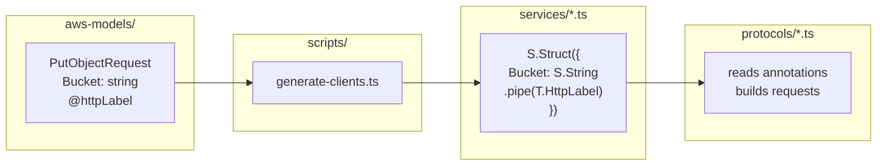

# distilled-aws

Effect-native AWS SDK. Generates typed clients from Smithy models with full protocol support.

## CORE CONCEPTS



**Trait System:** Smithy traits become Schema annotations at codegen. At runtime, protocols read these annotations to serialize requests and parse responses.

**Effect-Native:** All operations return `Effect<A, E, R>` with typed errors. Error categories (throttling, transient, server) drive automatic retry policies.

**Protocol Support:** Five AWS protocols, each with its own serialization:
- `restJson1` — JSON body, HTTP binding traits (Lambda, API Gateway)
- `restXml` — XML body, HTTP bindings (S3, CloudFront)
- `awsJson1_0/1_1` — JSON body, `X-Amz-Target` header (DynamoDB, KMS)
- `awsQuery` — Form-urlencoded body (IAM, SNS, STS)
- `ec2Query` — EC2-specific query protocol

## INTENT LAYER

```
AGENTS.md (you are here)
├── src/
│   ├── client/AGENTS.md ────── API orchestration, signing, retries
│   ├── protocols/AGENTS.md ─── Request/response serialization
│   ├── rules-engine/AGENTS.md  Endpoint resolution
│   ├── eventstream/AGENTS.md ─ Bi-directional streaming
│   └── middleware/AGENTS.md ── Checksum, streaming body
├── scripts/AGENTS.md ───────── Code generator, cleanup utilities
└── test/
    └── services/AGENTS.md ──── Live AWS integration tests
```

**Read the node for where you're working.** Follow downlinks for detail.

## COMMANDS

```bash
bun generate --sdk s3                    # Generate service client
bun vitest run ./test/services/s3.test.ts # Run live AWS test
bun vitest run ./test/protocols/         # Run protocol unit tests
bun find:errors "explore S3 errors"      # Discover undocumented errors
```

## KEY FILES

| What | Where |
|------|-------|
| API client (`API.make`, `API.makePaginated`) | `src/client/api.ts` |
| Smithy traits (`T.HttpHeader`, `T.XmlName`) | `src/traits.ts` |
| Request/response flow | `src/client/request-builder.ts`, `src/client/response-parser.ts` |
| Code generator | `scripts/generate-clients.ts` |
| Generated clients | `src/services/*.ts` (DO NOT EDIT) |
| Error patches | `spec/*.json` |

## CONVENTIONS

**Code:**
- `const` arrow functions, `Effect.gen` + `pipe`, avoid explicit `return`
- `Effect.retry` + `Schedule` instead of loops/sleeps
- Commits: `feat:`, `fix:`, `chore:`, `refactor:`, `docs:`, `test:`

**Testing:**
- Use `expect` from `@effect/vitest` — NOT `Effect.fail`
- Deterministic names: `itty-{service}-{test}` — NO random suffixes
- Live AWS by default — `LOCAL=1` only when explicitly requested

**Smithy:**
- 1:1 with Smithy traits — all traits flow into generated code
- Protocol tests use real schemas from `src/services/*.ts`

## EXPLORING SMITHY MODELS

Models are too large for context. Explore with:

```bash
bun -e "
const model = await Bun.file('aws-models/models/s3/service/2006-03-01/s3-2006-03-01.json').json();
console.log(Object.entries(model.shapes).filter(([_,s]) => s.type === 'operation').map(([id]) => id.split('#')[1]).join('\n'));
"
```

## EXTERNAL REFERENCES

- `smithy/docs/source-2.0/` — Smithy specification
- `aws-models/models/` — AWS Smithy model definitions
- `aws-sdk-js-v3/` — Reference implementation
