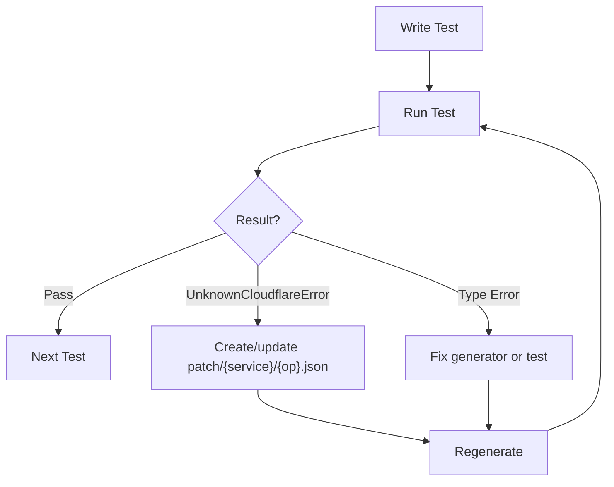

# distilled-cloudflare

> See [../AGENTS.md](../AGENTS.md) for ecosystem overview and shared TDD patterns.

Effect-native Cloudflare SDK generated from the [Cloudflare TypeScript SDK](https://github.com/cloudflare/cloudflare-typescript) source code.

## Commands

```bash
bun generate                              # Generate all services
bun generate --service r2                 # Generate single service
bun vitest run ./test/services/r2.test.ts # Run tests
bun tsc -b                                # Type check
```

## Architecture

```
cloudflare-typescript/src/resources/*.ts → Generator → src/services/*.ts → Runtime
              ↓                               ↓              ↓               ↓
        SDK Source Code      patch/{service}/{op}.json  Schemas + Traits  Response Parser
```

**Generator:** `scripts/generate-from-sdk.ts` (uses `scripts/parse.ts` + `scripts/model.ts`)

1. Parses TypeScript AST from `cloudflare-typescript/src/resources/` (`parse.ts`)
2. Extracts operations from SDK class methods (get, post, put, patch, delete)
3. Builds a type registry and resolves types from SDK params/response interfaces (`model.ts`)
4. Loads error patches from `patch/{service}/{operation}.json` (one file per operation)
5. Generates Effect Schema request/response types with trait annotations
6. Generates error classes with `T.HttpErrorMatchers` trait from patches
7. Outputs to `src/services/{service}.ts`

## Key Files

| File                                   | Purpose                                                 |
| -------------------------------------- | ------------------------------------------------------- |
| `scripts/generate-from-sdk.ts`         | Code generator entrypoint                               |
| `scripts/parse.ts`                     | AST parsing + operation discovery                       |
| `scripts/model.ts`                     | Type registry + type resolution helpers                 |
| `patch/{service}/{operation}.json`     | Error patches per operation (expression DSL)            |
| `src/expr.ts`                          | Expression DSL types for error matching                 |
| `src/services/{service}.ts`            | Generated client (DO NOT EDIT)                          |
| `src/client/request-builder.ts`        | Builds HTTP requests from annotated schemas             |
| `src/client/response-parser.ts`        | Parses responses and matches errors                     |
| `src/traits.ts`                        | Schema annotations for HTTP bindings and error matching |
| `src/schemas.ts`                       | Common schemas (file uploads, etc.)                     |
| `distilled.config.ts`                  | Agent definitions for test generation                   |
| `test/services/{service}/helpers.ts`   | Test helpers (withBucket, withQueue, etc.)              |
| `test/services/{service}/{op}.test.ts` | Tests per operation                                     |

## Traits

HTTP bindings and error matching as Schema annotations:

| Trait                                    | Purpose                                             |
| ---------------------------------------- | --------------------------------------------------- |
| `T.HttpPath(name)`                       | Path parameter                                      |
| `T.HttpQuery(name)`                      | Query parameter                                     |
| `T.HttpHeader(name)`                     | Header                                              |
| `T.JsonName(name)`                       | JSON serialization key (for camelCase → snake_case) |
| `T.Http({ method, path, contentType? })` | Operation-level HTTP metadata                       |
| `T.HttpFormDataFile()`                   | File upload in multipart form                       |
| `T.HttpErrorMatchers([...])`             | Expression-based error matching (preferred)         |
| `T.HttpErrorCode(code)`                  | Match error by single code (legacy)                 |
| `T.HttpErrorCodes([...])`                | Match error by multiple codes (legacy)              |
| `T.HttpErrorStatus(status)`              | Match error by HTTP status (legacy)                 |
| `T.HttpErrorMessage(pattern)`            | Match error by message substring (legacy)           |

## Error Patching

Patches are stored per-operation at `patch/{service}/{operation}.json` using an expression DSL.

### Workflow

When you see `UnknownCloudflareError`:

1. Extract the error code from the failure:

   ```bash
   DEBUG=1 bun vitest run ./test/services/r2/getBucket.test.ts
   ```

2. Create or update `patch/{service}/{operation}.json`:

   ```json
   {
     "errors": {
       "NoSuchBucket": [
         { "code": 10006 }
       ]
     }
   }
   ```

3. Regenerate: `bun generate --service {service}`

4. Import the new error class in your test and verify.

### Expression DSL

Each error tag maps to an array of matchers. The error is matched if ANY matcher matches.

```json
{
  "errors": {
    "NoSuchBucket": [
      { "code": 10006 }
    ],
    "NoCorsConfiguration": [
      { "code": 10059 },
      { "code": 10000, "message": { "includes": "CORS configuration not found" } }
    ],
    "BucketAlreadyExists": [
      { "code": 10002, "status": 409 }
    ],
    "InvalidBucketName": [
      { "code": 10001, "message": { "matches": "bucket name .* is invalid" } }
    ]
  }
}
```

**Matcher Fields:**

| Field     | Required | Description                           |
| --------- | -------- | ------------------------------------- |
| `code`    | Yes      | Cloudflare error code                 |
| `status`  | No       | HTTP status code (for disambiguation) |
| `message` | No       | Message matcher object                |

**Message Matcher Options:**

| Field      | Description                    |
| ---------- | ------------------------------ |
| `includes` | Message must contain substring |
| `matches`  | Message must match regex       |

**Matching Priority:** code + status + message > code + status > code + message > code only

## Generator Details

### Naming Conventions

The generator automatically:

- Converts `snake_case` params to `camelCase` (with `T.JsonName` for serialization)
- Maps HTTP verbs: `update` → `put` (when no create exists), `edit` → `patch`
- Handles bulk operations: `bulkDelete` → `batchDelete`
- Deduplicates consecutive segments: `CreateOperationOperation` → `CreateOperation`
- Pluralizes batch resources: `batchDeleteOperations`

### File Uploads

When the SDK uses `Core.Uploadable` types, the generator:

1. Detects file parameters in body
2. Generates `UploadableSchema.pipe(T.HttpFormDataFile())`
3. Adds `contentType: "multipart"` to the `T.Http` trait
4. TypeScript type becomes `File | Blob`

### Generator Issues

| Symptom                   | Cause                                             | Fix                                             |
| ------------------------- | ------------------------------------------------- | ----------------------------------------------- |
| `unknown` type in output  | SDK type not resolved                             | Improve type resolution in `typeNodeToTypeInfo` |
| Wrong property name       | camelCase conversion issue                        | Fix `toCamelCase` or naming logic               |
| Missing trait             | Parameter location not detected                   | Update param extraction logic                   |
| Schema/interface mismatch | `typeInfoToSchema` and `typeInfoToTsType` diverge | Apply same fix to both                          |

## Testing Protocol

### Test Organization

Tests are organized by API operation:

```typescript
describe("Workers", () => {
  describe("listWorkers", () => {
    test("happy path - lists workers in account", () =>
      Effect.gen(function* () {
        const result = yield* Workers.listWorkers({ account_id: accountId() });
        expect(result.result).toBeDefined();
        expect(Array.isArray(result.result)).toBe(true);
      }));

    test("error - WorkerNotFound for non-existent", () =>
      Workers.getWorkerSettings({
        account_id: accountId(),
        script_name: "non-existent-worker-xyz",
      }).pipe(
        Effect.flip,
        Effect.map((e) => expect(e._tag).toBe("WorkerNotFound")),
      ));
  });
});
```

### Resource Naming

`distilled-cf-{service}-{testname}` — deterministic, enables cleanup

### TDD Loop



### When to Stop and Ask

| Situation                  | Action                               |
| -------------------------- | ------------------------------------ |
| Missing credentials        | Request user add env vars            |
| Rate limiting              | Request user wait or increase limits |
| Account-level restrictions | Request user enable feature          |
| Ambiguous API behavior     | Ask for clarification                |
| Breaking generator change  | Ask for approval                     |

Do NOT stop for:

- `UnknownCloudflareError` → Add to patch and continue
- Type errors → Fix and continue
- Flaky tests → Add retry logic and continue

## Test Generation with distilled-code

Tests are generated using distilled-code agents. The `distilled.config.ts` defines one agent per operation.

### Running Agents

```bash
# List all agents
distilled --list

# Run a specific agent
distilled "r2/getBucket" "Complete the test implementation"

# Run all agents for a service
distilled "r2/*" "Complete the test implementations"
```

### Skeleton Generation

When the config runs, it generates skeleton files before spawning agents:

**Test skeleton** (`test/services/{service}/{operation}.test.ts`):

- Correct imports already in place
- Describe blocks for success and error cases
- TODO comments guiding implementation
- Example error test structure in comments

**Helpers skeleton** (`test/services/{service}/helpers.ts`):

- withXYZ helper patterns for each resource
- Cleanup-first pattern for idempotency
- Effect.ensuring for guaranteed cleanup

### Agent Workflow

1. Agent reads the skeleton (structure already correct)
2. Fills in happy path tests, removing `.skip`
3. Runs tests to discover errors
4. Creates/updates patch file with discovered error codes
5. Runs `bun generate --service {service}` to regenerate
6. Imports new error class and adds error tests
7. Repeats until all tests pass

## Environment

```bash
# Required
CLOUDFLARE_API_TOKEN=xxx
CLOUDFLARE_ACCOUNT_ID=xxx

# Optional (for zone-scoped tests)
CLOUDFLARE_ZONE_ID=xxx

# Download from Doppler
bun run download:env
```

## Service Notes

**Queues:**

- Create `http_pull` consumer before pulling messages

**R2:**

- Location enum has uppercase/lowercase variants
- Fresh buckets return `NoCorsConfiguration` (not 404)

**Workers:**

- Upload via FormData with metadata blob and files array
- `getContent` returns `FormData` with worker modules as `File` entries
- Workflows require a worker that exports Workflow class
- Uses `contentType: "multipart"` for script upload operations

## Multipart Handling

### Requests

Operations with file uploads are automatically detected and marked with `contentType: "multipart"`:

```typescript
// Generated schema for file uploads
files: Schema.optional(Schema.Array(UploadableSchema.pipe(T.HttpFormDataFile())))

// Generated interface
files?: (File | Blob)[];

// Generated Http trait
T.Http({ method: "PUT", path: "...", contentType: "multipart" })
```

### Responses

Some APIs return `multipart/form-data` instead of JSON (e.g., downloading worker scripts):

```typescript
const formData = yield* Workers.getContent({
  account_id: accountId(),
  script_name: "my-worker",
});

// Iterate all modules
for (const [name, file] of formData.entries()) {
  const content = yield* Effect.promise(() => (file as File).text());
  console.log(name, content);
}
```
