# distilled-cloudflare

Effect-native Cloudflare SDK generated from the [Cloudflare TypeScript SDK](https://github.com/cloudflare/cloudflare-typescript) source code.

## COMMANDS

```bash
bun generate                              # Generate all services
bun generate --service r2                 # Generate single service
bun vitest run ./test/services/r2.test.ts # Run tests
bun tsc -b                                # Type check (run before committing)
```

## ARCHITECTURE

```
cloudflare-typescript/src/resources/*.ts → Generator → src/services/*.ts → Runtime
              ↓                               ↓              ↓               ↓
        SDK Source Code            spec/{service}.json  Schemas + Traits  Response Parser
```

**Generator:** `scripts/generate-from-sdk.ts`

1. Parses TypeScript AST from `cloudflare-typescript/src/resources/`
2. Extracts operations from SDK class methods (get, post, put, patch, delete)
3. Resolves types from SDK params/response interfaces
4. Loads error definitions from `spec/{service}.json`
5. Generates Effect Schema request/response types with trait annotations
6. Outputs to `src/services/{service}.ts`

**Key Files:**

| File | Purpose |
|------|---------|
| `scripts/generate-from-sdk.ts` | Code generator (parses SDK source) |
| `spec/{service}.json` | Error definitions and per-operation error assignments |
| `src/services/{service}.ts` | Generated client (DO NOT EDIT) |
| `src/client/request-builder.ts` | Builds HTTP requests from annotated schemas |
| `src/client/response-parser.ts` | Parses responses and matches errors |
| `src/traits.ts` | Schema annotations for HTTP bindings and error matching |
| `src/schemas.ts` | Common schemas (file uploads, etc.) |
| `test/services/{service}.test.ts` | Tests that drive error discovery |

---

## CODE GENERATOR

The generator (`scripts/generate-from-sdk.ts`) parses the Cloudflare TypeScript SDK source code directly using the TypeScript Compiler API.

### How It Works

1. **Parse SDK classes** - Finds resource classes with HTTP methods (get, post, put, patch, delete)
2. **Extract operations** - Each method becomes an operation with path, method, params
3. **Resolve types** - Uses TypeChecker to resolve param/response types recursively
4. **Apply naming conventions** - Converts to camelCase, handles CRUD verbs, pluralization
5. **Generate schemas** - Creates Effect Schema structs with HTTP trait annotations
6. **Apply error patches** - Reads `spec/{service}.json` to add typed errors

### Naming Conventions

The generator automatically:
- Converts `snake_case` params to `camelCase` (with `T.JsonName` for serialization)
- Maps HTTP verbs: `update` → `put` (when no create exists), `edit` → `patch`
- Handles bulk operations: `bulkDelete` → `batchDelete`
- Deduplicates consecutive segments: `CreateOperationOperation` → `CreateOperation`
- Pluralizes batch resources: `batchDeleteOperations`

### Traits

HTTP bindings and error matching as Schema annotations:

| Trait | Purpose |
|-------|---------|
| `T.HttpPath(name)` | Path parameter |
| `T.HttpQuery(name)` | Query parameter |
| `T.HttpHeader(name)` | Header |
| `T.JsonName(name)` | JSON serialization key (for camelCase → snake_case) |
| `T.Http({ method, path, contentType? })` | Operation-level HTTP metadata |
| `T.HttpFormDataFile()` | File upload in multipart form |
| `T.HttpErrorCode(code)` | Match error by single code |
| `T.HttpErrorCodes([...])` | Match error by multiple codes |
| `T.HttpErrorStatus(status)` | Match error by HTTP status |
| `T.HttpErrorMessage(pattern)` | Match error by message substring |

### File Uploads

When the SDK uses `Core.Uploadable` types, the generator:
1. Detects file parameters in body
2. Generates `UploadableSchema.pipe(T.HttpFormDataFile())` 
3. Adds `contentType: "multipart"` to the `T.Http` trait
4. TypeScript type becomes `File | Blob`

---

## ERROR DISCOVERY AND PATCHING

The Cloudflare API returns error codes that aren't documented. Tests discover these errors, and you patch them into `spec/{service}.json`.

### The TDD Loop


### When You See `UnknownCloudflareError`

1. **Extract the error code** from the failure message:

```bash
DEBUG=1 bun vitest run ./test/services/r2.test.ts -t "CORS"
```

Or log in the test:

```typescript
const result = yield* someOperation().pipe(Effect.exit);
console.log(JSON.stringify(result, null, 2));
// Shows: { "code": 10059, "message": "The CORS configuration does not exist." }
```

2. **Add error to `spec/{service}.json`**:

```json
{
  "errors": {
    "NoSuchBucket": { "code": 10006, "status": 404 },
    "NoCorsConfiguration": { "code": 10059 },
    "ValidationError": { "code": 100021 }
  },
  "operations": {
    "getBucketCorsPolicy": {
      "errors": { "NoSuchBucket": {}, "NoCorsConfiguration": {} }
    },
    "deleteBucketCorsPolicy": {
      "errors": { "NoSuchBucket": {}, "NoCorsConfiguration": {} }
    }
  }
}
```

3. **Regenerate**: `bun generate --service {service}`

4. **Re-run tests**

### Error Matching Options

| Field | Description |
|-------|-------------|
| `code` | Single Cloudflare error code |
| `codes` | Array of codes that map to the same error |
| `status` | HTTP status code (for disambiguation) |
| `message` | Substring match on error message |

**Matching priority:** code + status + message > code + status > code only

---

## AGENT TESTING PROTOCOL

This section defines the **mandatory** process for AI agents adding comprehensive test coverage to a service.

### Protocol Overview

```mermaid
flowchart LR
    A[1. IDENTIFY] --> B[2. PLAN]
    B --> C[3. BATCH]
    C --> D[4. IMPLEMENT]
    D --> E[5. DIAGNOSE]
    E --> F{All tests pass?}
    F -->|No| D
    F -->|Yes| G{More batches?}
    G -->|Yes| C
    G -->|No| H[✅ Complete]
```



### Step 1: Identify Services Needing Tests

Enumerate all operations for the target service and identify which need tests:

```bash
# List all exported functions for a service
grep "^export const" src/services/{service}.ts | head -100

# Check existing test coverage
grep "describe\|test(" test/services/{service}.test.ts 2>/dev/null || echo "No tests yet"
```

For each operation, determine:
- Does it have a happy path test?
- Does it have error case tests?
- What error cases are possible?

### Step 2: Create Test Plan

Document ALL operations with their happy path and error cases **before writing any code**:

```markdown
## Test Plan: {Service}

### Operation: createBucket
**Happy Path:** Create bucket with valid name, verify bucket is created
**Error Cases:**
| Error Tag | Trigger | Expected? |
|-----------|---------|-----------|
| BucketAlreadyExists | Create bucket with existing name | ❌ Discover |
| ValidationError | Create bucket with invalid name | ❌ Discover |

### Operation: deleteBucket  
**Happy Path:** Delete existing bucket
**Error Cases:**
| Error Tag | Trigger | Expected? |
|-----------|---------|-----------|
| NoSuchBucket | Delete non-existent bucket | ✅ In spec |
| BucketNotEmpty | Delete bucket with objects | ❌ Discover |
```

**Expected?** column indicates:
- ✅ In spec - Error already defined in `spec/{service}.json`
- ❌ Discover - Error needs to be discovered and added

### Step 3: Batch Tests

Group tests into batches of ~3-5 operations for manageable iteration:

```markdown
## Batch 1: Bucket CRUD
- createBucket
  - happy: Create bucket, verify bucket exists
  - error: BucketAlreadyExists - create bucket with existing name
  - error: ValidationError - create bucket with invalid name
- getBucket
  - happy: Get existing bucket metadata
  - error: NoSuchBucket - get non-existent bucket
- deleteBucket
  - happy: Delete existing empty bucket
  - error: NoSuchBucket - delete non-existent bucket
  - error: BucketNotEmpty - delete bucket with objects

## Batch 2: Bucket Configuration  
- getBucketCorsPolicy
  - happy: Get CORS policy from bucket with CORS configured
  - error: NoSuchBucket - get CORS from non-existent bucket
  - error: NoCorsConfiguration - get CORS from bucket without CORS
```

### Step 4: Implement Tests

For each batch:

1. **Write all tests** (happy path + error cases)
2. **Type-check**: `bun tsc -b`
3. **Fix type errors** before running tests
4. **Run tests**: `bun vitest run ./test/services/{service}.test.ts`

### Step 5: Diagnose Failures

When tests fail, categorize the issue:

| Failure Type | Symptom | Fix |
|--------------|---------|-----|
| **Generator Bug** | Type mismatch between interface and schema | Fix `scripts/generate-from-sdk.ts` |
| **Client Bug** | Incorrect request/response handling | Fix `src/client/*.ts` |
| **Missing Error** | `UnknownCloudflareError` | Add to `spec/{service}.json` |

### Step 6: Iterate Until Complete

```mermaid
flowchart TD
    A[Test Fails] --> B{Failure Type?}
    B -->|UnknownCloudflareError| C["Add to spec/service.json"]
    B -->|Type error| E[Fix generator or test]
    B -->|Needs user action| F["🛑 STOP & Request Help"]
    C --> G[Regenerate]
    E --> G
    G --> H[Re-run tests]
    H --> I{Pass?}
    I -->|No| A
    I -->|Yes| J[Next test/batch]
```



**Rules:**
- ❌ Do NOT mark tests as skipped or todo
- ❌ Do NOT move to next batch until current batch passes
- ✅ Iterate until 100% operation coverage
- ⚠️ EXCEPTION: Skip account-level destructive operations that permanently affect the entire account

**Completion Criteria:**
- Every operation has at least one happy path test
- Every operation has error case tests for all discoverable errors
- All tests pass: `bun vitest run ./test/services/{service}.test.ts`
- Type-check passes: `bun tsc -b`

### When to Request Intervention

Stop and ask for user help ONLY when:

| Situation | Action |
|-----------|--------|
| **Missing credentials** | Request user add env vars |
| **Rate limiting** | Request user wait or increase limits |
| **Account-level restrictions** | Request user enable feature in dashboard |
| **Ambiguous API behavior** | Ask for clarification on expected behavior |
| **Breaking change to generator** | Ask for approval before modifying generator |

Do NOT stop for:
- `UnknownCloudflareError` → Add to spec and continue
- Type errors → Fix and continue
- Flaky tests → Add retry logic and continue

---

## TEST PATTERNS

### Test Organization Convention

**Tests are organized by API operation, not by feature or priority.** Each API gets its own `describe` block containing both happy path and error tests:

```typescript
describe("Workers", () => {
  describe("listWorkers", () => {
    test("happy path - lists workers in account", () =>
      Effect.gen(function* () {
        const result = yield* Workers.listWorkers({ account_id: accountId() });
        expect(result.result).toBeDefined();
        expect(Array.isArray(result.result)).toBe(true);
      }));
    
    test("error - returns empty array for valid account", () =>
      // ... error case tests
    );
  });

  describe("getWorkerSettings", () => {
    test("happy path - gets settings for existing worker", () =>
      withWorker("itty-cf-workers-settings", (scriptName) =>
        Effect.gen(function* () {
          const settings = yield* Workers.getWorkerSettings({
            account_id: accountId(),
            script_name: scriptName,
          });
          expect(settings.result).toBeDefined();
        }),
      ));

    test("error - WorkerNotFound for non-existent worker", () =>
      Workers.getWorkerSettings({
        account_id: accountId(),
        script_name: "non-existent-worker-xyz",
      }).pipe(
        Effect.flip,
        Effect.map((e) => expect(e._tag).toBe("WorkerNotFound")),
      ));
  });
});
```

**Key principles:**
1. **One describe per API** - All tests for `listWorkers` go under `describe("listWorkers")`
2. **Happy path first** - Start with the success case
3. **Error cases second** - Follow with error scenarios for the same API
4. **Use `withXxx` helpers** - Create resources with deterministic names and `Effect.ensuring` for cleanup
5. **Group related APIs** - When APIs are tightly coupled (e.g., `createWorker`/`deleteWorker`), they can share a describe

### Resource lifecycle helper

```typescript
const withBucket = <A, E, R>(
  name: string,
  fn: (bucket: string) => Effect.Effect<A, E, R>,
) =>
  cleanup(name).pipe(
    Effect.andThen(createBucket({ name })),
    Effect.andThen(fn(name)),
    Effect.ensuring(cleanup(name)),
  );

const cleanup = (name: string) =>
  deleteBucket({ bucket_name: name }).pipe(Effect.ignore);
```

### Error expectation

```typescript
test("NoSuchBucket on non-existent", () =>
  R2.getBucket({ account_id: accountId(), bucket_name: "does-not-exist" }).pipe(
    Effect.flip,
    Effect.map((e) => expect(e._tag).toBe("NoSuchBucket")),
  ));
```

### Naming convention

- `itty-cf-{service}-{testname}`
- Deterministic — same on every run
- Enables cleanup of leftovers from crashed tests

---

## ADDING A NEW SERVICE

1. Generate: `bun generate --service myservice`
2. Write tests in `test/services/myservice.test.ts`
3. Run tests, discover failures
4. For `UnknownCloudflareError`: catalog in `spec/myservice.json`
5. For type errors: fix `scripts/generate-from-sdk.ts`
6. Regenerate: `bun generate --service myservice`
7. Repeat until all tests pass

---

## FIXING GENERATOR BUGS

Sometimes the issue is how we parse the SDK or generate schemas. These require fixes to `scripts/generate-from-sdk.ts`.

### Common Generator Issues

| Symptom | Cause | Fix |
|---------|-------|-----|
| `unknown` type in output | SDK type not resolved | Improve type resolution in `typeNodeToTypeInfo` |
| Wrong property name | camelCase conversion issue | Fix `toCamelCase` or naming logic |
| Missing trait | Parameter location not detected | Update param extraction logic |
| Schema/interface mismatch | `typeInfoToSchema` and `typeInfoToTsType` diverge | Apply same fix to both |

### Generator Fix Workflow

1. **Identify the root cause** - Is it a parsing issue or generation issue?
2. **Fix both type generation AND schema generation** - Keep `typeInfoToTsType` and `typeInfoToSchema` in sync
3. **Regenerate and verify**: `bun generate --service {service}`

---

## ENVIRONMENT

```bash
# Required
CLOUDFLARE_API_TOKEN=xxx
CLOUDFLARE_ACCOUNT_ID=xxx

# Optional (for zone-scoped tests)
CLOUDFLARE_ZONE_ID=xxx

# Download from Doppler
bun run download:env
```

---

## SERVICE NOTES

**Queues:**
- Create `http_pull` consumer before pulling messages

**R2:**
- Location enum has uppercase/lowercase variants
- Fresh buckets return `NoCorsConfiguration` (not 404)

**Workers:**
- Upload via FormData with metadata blob and files array
- `getContent` returns `FormData` with worker modules as `File` entries
- Workflows require a worker that exports Workflow class
- Uses `contentType: "multipart"` for script upload operations

---

## MULTIPART REQUESTS

Operations with file uploads are automatically detected and marked with `contentType: "multipart"`.

```typescript
// Generated schema for file uploads
files: Schema.optional(Schema.Array(UploadableSchema.pipe(T.HttpFormDataFile())))

// Generated interface
files?: (File | Blob)[];

// Generated Http trait
T.Http({ method: "PUT", path: "...", contentType: "multipart" })
```

The request builder uses `contentType: "multipart"` to build FormData requests instead of JSON.

---

## MULTIPART RESPONSES

Some APIs return `multipart/form-data` instead of JSON (e.g., downloading worker scripts).

These are automatically detected and return `FormData`:

```typescript
const formData = yield* Workers.getContent({
  account_id: accountId(),
  script_name: "my-worker",
});

// Iterate all modules
for (const [name, file] of formData.entries()) {
  const content = yield* Effect.promise(() => (file as File).text());
  console.log(name, content);
}
```
